# Dungeon-Duo

A roguelike game featuring procedural map generation

## Gameplay
- serveral maps
  
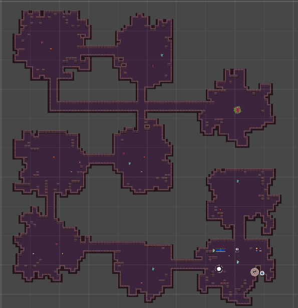

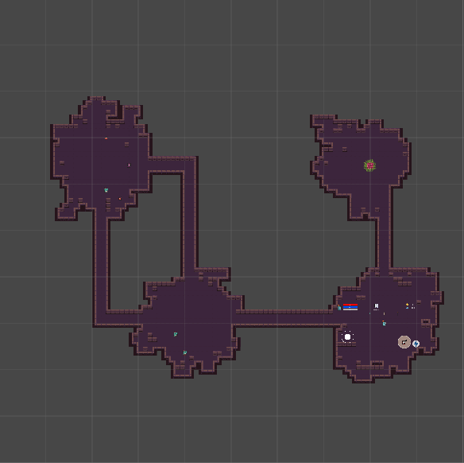

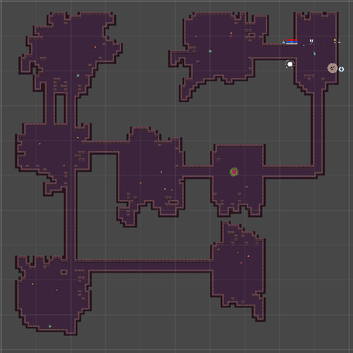

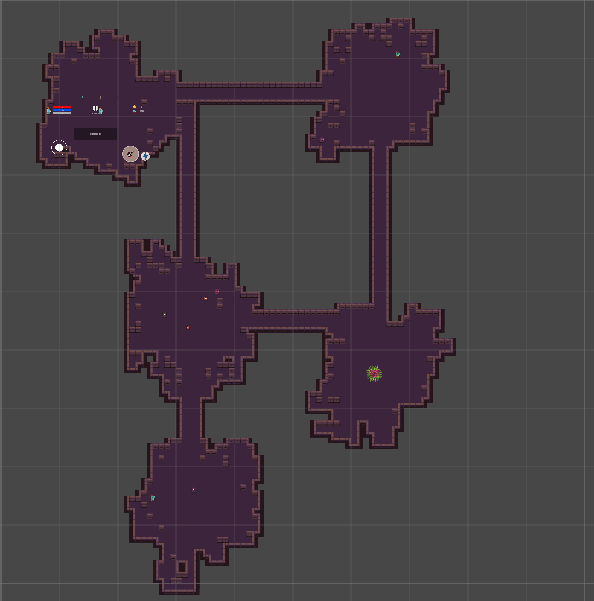

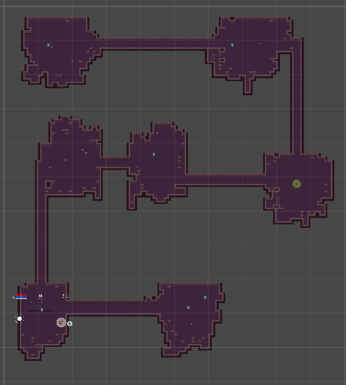

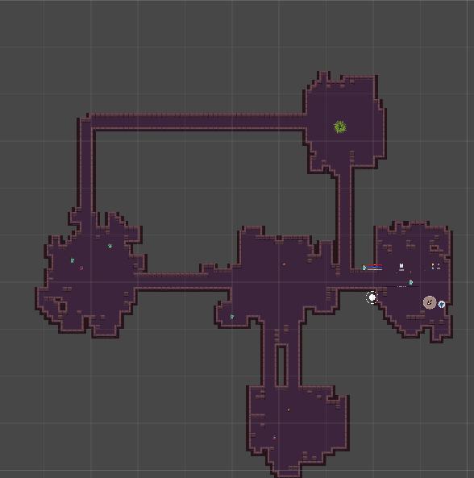

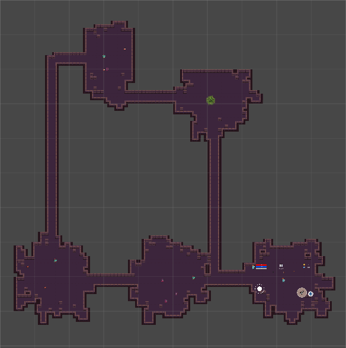

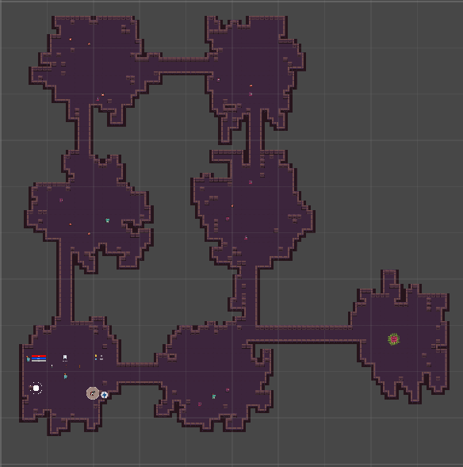

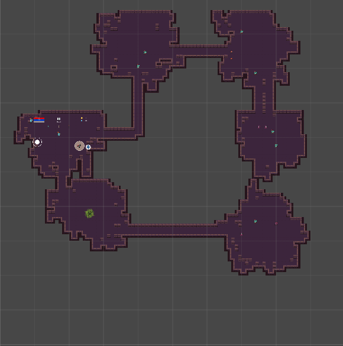

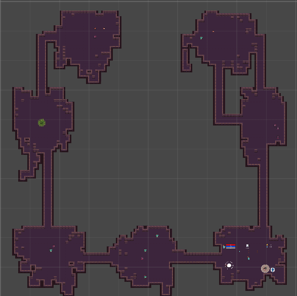

- Menu
  
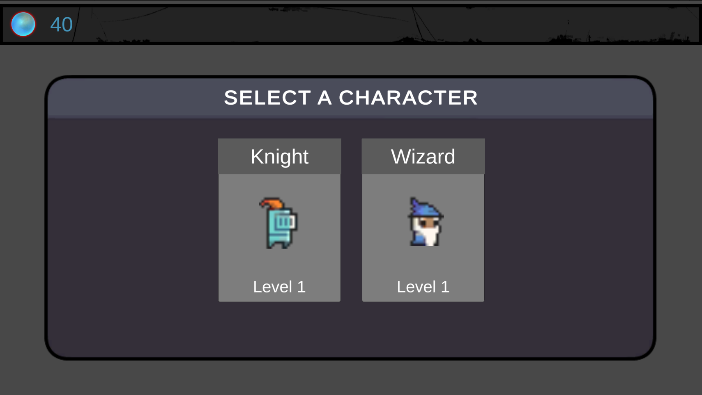

- Enemies
 
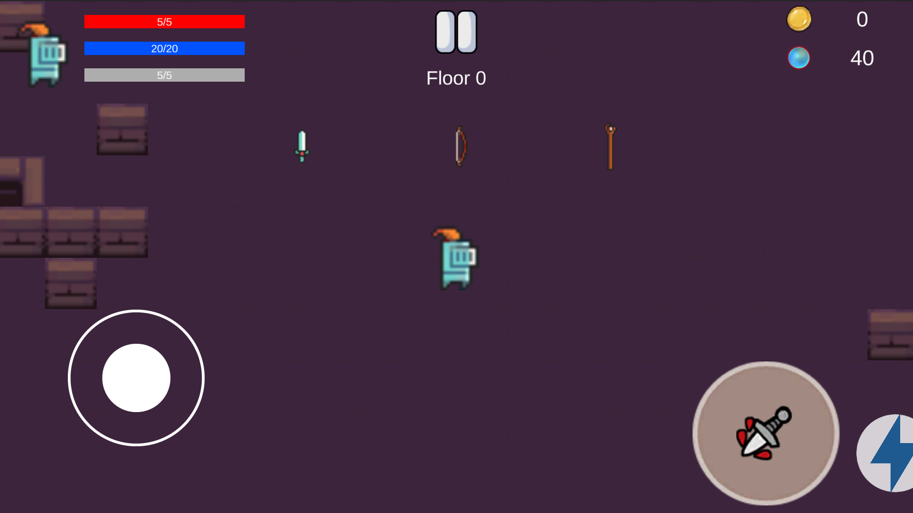

- Boss

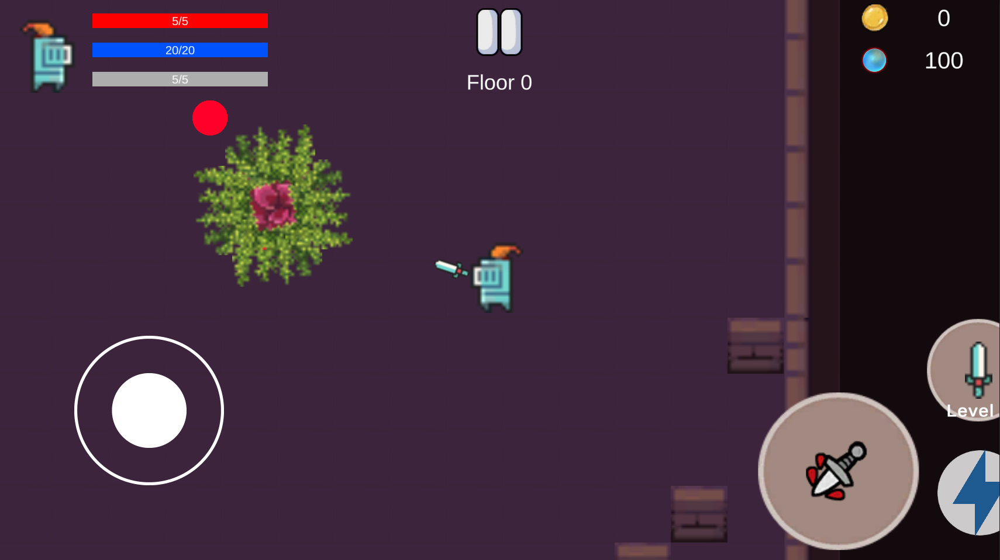

## Features

- Procedural map generation
- AI Enemies and Bosses behavior
- Inventory System
- Character stat system
  
## Tech Stack

- Unity
- C#
- DOTween
## How to Run

1. Clone repository

git clone https://github.com/kalimatar3/Dungeon-Duo.git

2. Open with Unity Hub (Unity 6+)
3. Open scene Assets/Scenes/0_LoadingScence.unity
4. Press Play
